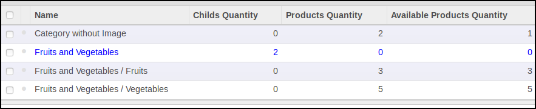
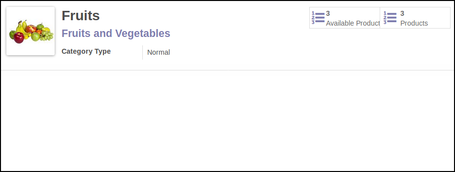
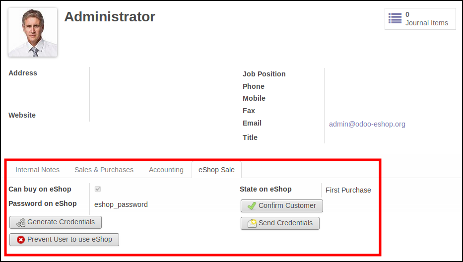
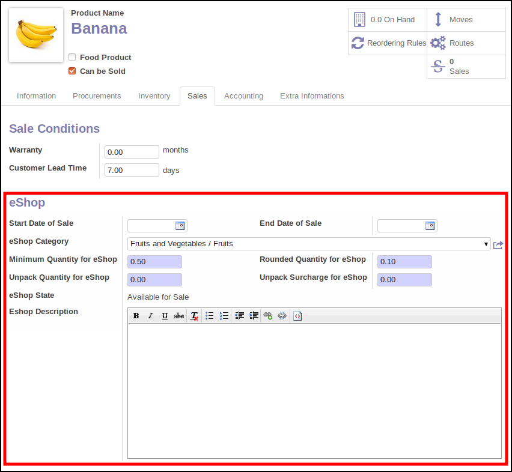
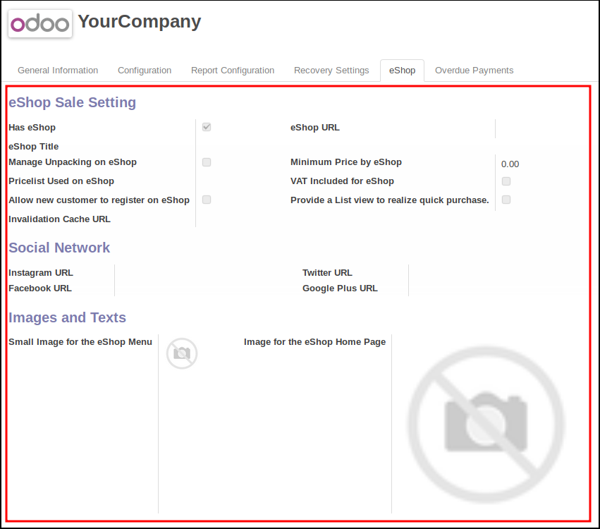
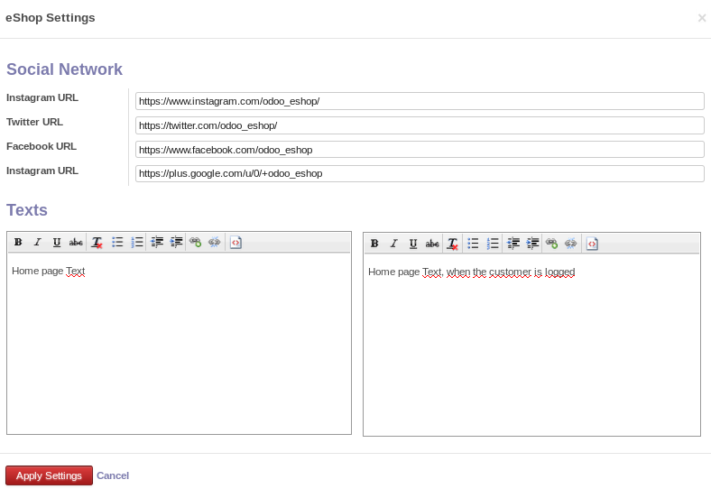

This module is the 'odoo' part of the project Odoo eShop.

the 'client' part is available here : https://github.com/grap/odoo-eshop

eShop Categories
~~~~~~~~~~~~~~~~

Add a new model ``eshop.category`` to have the possibility to dispatch products
for the eshop.

Customers
~~~~~~~~~

Add new fields on ``res.partner`` to handle authentication on the eshop.
It is maid with a couple ``email`` and ``eshop_password``.

Products
~~~~~~~~

Add new fields on ``product.product`` that handles display on eShop.

* 'eShop Category': category in the eShop
* 'Start date' and 'End Date' to disable temporarily the sale on the eShop
* 'Minimum Quantity', that will force user to buy at least that quantity
* 'Rounded Quantity', that will round quantity purchased

Furthermore, it is possible to allow consumers to buy less than the minimum
quantity, setting 'Unpack Quantity' value. In that case, a surcharge can
be applied in the field 'Unpack Surcharge'.

Companies
~~~~~~~~~

General settings are available via company form.

The important fields are :

* 'has Eshop', that enable all the connexion
* 'eShop URL'
* 'Invalidation Cache URL', to enable invalidation cache system. (see below)

Some of cosmectics fields are available in a wizard, to be change by end users.

you have to go in 'Sale' / 'Configuration' / 'eShop Sale' / 'eShop Settings'

Other models
~~~~~~~~~~~~

Furthermore, other models like ``account.tax`` has extra fields that will
be displayed on the eshop.

Technical Informations
~~~~~~~~~~~~~~~~~~~~~~

* The connection from the eShop into odoo, is made with a unique user, that
  has to be member of the group "Is eShop".
  Then, an extra authentication is available via partners.

* Some datas are cached by the eShop, to avoid useless call to odoo. So,
  if data changes, the cached should be invalidated. for that purpose,
  an extra abstract model ``eshop.mixin`` is available. Models synchronized
  with eShop should inherit of that model, and defined two values :

1. ``_eshop_invalidation_type`` : ``single`` / ``multiple`` to indicate
   if all the eShops should be invalidated, or only the one of the current
   object
2. ``_eshop_invalidation_fields`` : the list of the fields that trigger
   invalidation
